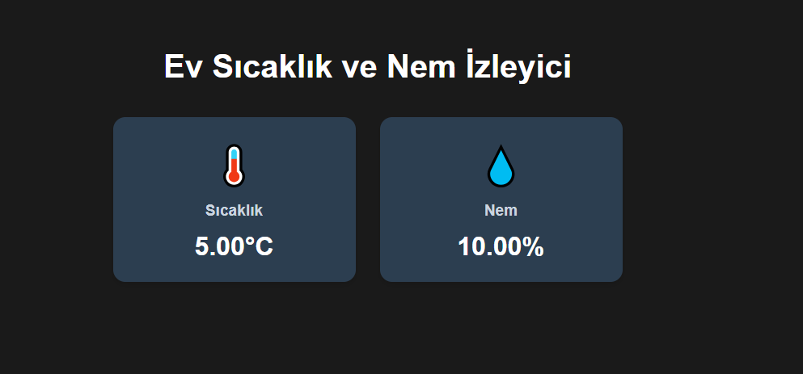

# Ev Sıcaklık ve Nem İzleyici

MQTT protokolü üzerinden gelen sıcaklık ve nem verilerini gerçek zamanlı olarak görüntüleyen bir web uygulaması. React kullanılarak geliştirilmiş modern ve kullanıcı dostu bir arayüz sunar.



## Özellikler

- 🌡️ Gerçek zamanlı sıcaklık takibi
- 💧 Gerçek zamanlı nem takibi
- 🌓 Koyu/Açık tema desteği
- 📱 Mobil uyumlu tasarım

## Kurulum

1. Projeyi klonlayın:

```bash
git clone https://github.com/yourusername/ev-sicaklik-nem-izleyici.git
cd ev-sicaklik-nem-izleyici
```

2. Gerekli paketleri yükleyin:

```bash
npm install
```

3. Uygulamayı başlatın:

```bash
npm start
```

4. Uygulamayı görüntüleyin:

```bash
http://localhost:3000
```
                                                                                                            